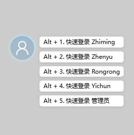
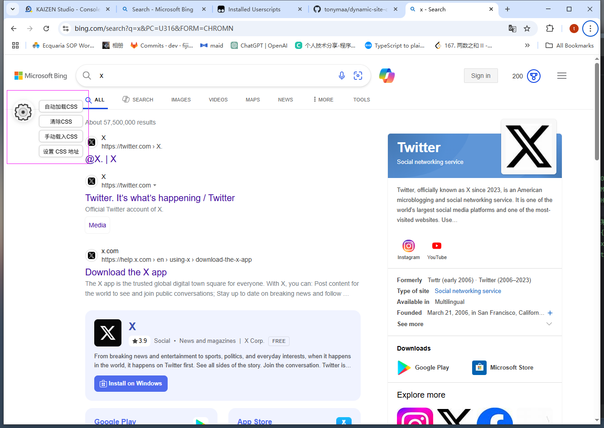
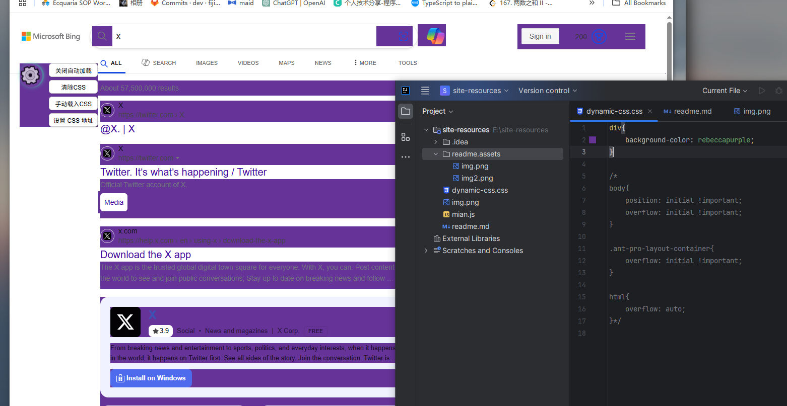

1. 油猴导入main.js脚本


2. 配置nginx
```nginx
       location /site-resources {
            alias E:/site-resources/;

            # 启用 CORS 头部
            add_header Access-Control-Allow-Origin *;
            add_header Access-Control-Allow-Methods 'GET, OPTIONS';
            add_header Access-Control-Allow-Headers *;

            # 如果你还想支持 OPTIONS 预检请求（某些 fetch 会触发）
            if ($request_method = OPTIONS ) {
                add_header Access-Control-Max-Age 1728000;
                add_header Content-Type 'text/plain charset=UTF-8';
                add_header Content-Length 0;
                return 204;
            }
        }
```

3. 使用


